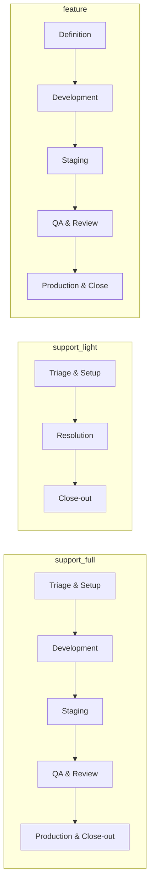

# ●—●—● Waypoint

Personal status tracker and external memory for developers. One row = one unit of work, identified by a card ref (`ZT-4821`, `OFF-5678`), moving through a fixed milestone pipeline with mandatory sub-task checklists — plus a weekly Tempo attestation strip and analytics.

Your AI updates it through the API using a personal access token and the instructions at **[`/llms.txt`](https://waypoint-bd.vercel.app/llms.txt)**. Waypoint stores card **references only** — no card contents, no free-text fields, no leaked customer data.

→ [CONTEXT.md](CONTEXT.md) · [spec-v2.md](spec-v2.md) · [docs/adr/](docs/adr/) · [`/docs`](https://waypoint-bd.vercel.app/docs) · [`/llms.txt`](https://waypoint-bd.vercel.app/llms.txt)

## Stack

Next.js (App Router) · PostgreSQL (Neon) + Drizzle · Better Auth · Tailwind · TanStack Query · Zod · Luxon

## Contents

- [Design principles](#design-principles)
- [How it works](#how-it-works)
- [Pipelines](#pipelines)
- [Using with your AI](#using-with-your-ai)
- [API](#api)
- [Local development](#local-development)
- [Privacy](#privacy)

---

## Design principles

**Refs, not contents.** There is no title, no description, no free-text field on a row. The identifier is the source of truth; Waypoint holds only its state. Share the app without leaking customer data; your AI can never accidentally write a description that becomes a de-facto second copy of the truth.

**Server computes progress; you report events.** You never decide what "complete" means — you report which sub-tasks happened, and the server auto-advances a milestone when its sub-tasks are all ticked.

**Memory over management.** Waypoint doesn't push cards through Jira, merge PRs, or send Teams messages. You (or your AI) still does the real work in the real tools — you just mirror the status here so nothing falls off your map.

**A false tick is a corrupted memory.** Sub-tasks marked `humanUsual` (local testing, staging/prod testing, deploys) are ticked only when you explicitly confirm — your AI never speculates.

---

## How it works

You do real work in Jira, GitHub, and Teams through your own connections — and then **mirror the status of that work into Waypoint**. Waypoint never touches those tools itself.

### Core concepts

| Concept | Description |
| :-- | :-- |
| **Row** | One unit of work. One row = one card, moving left-to-right through a pipeline. |
| **Card ref** | The identity of a row — e.g. `ZT-1234` (support), `OFF-5678` (product). Refs only, never card contents. |
| **Secondary refs** | Extra pointers on a row: PR links (`myrepo#42`), dupe bugs, related tickets. Lookup works by any ref the row carries. |
| **Milestone** | A phase in the pipeline (e.g. Development, Staging, QA). Completes when all its sub-tasks are checked; the bar auto-advances. |
| **Sub-task** | A checkbox inside a milestone. Some are marked `humanUsual` — those wait for explicit user confirmation. |
| **Timesheet** | A weekly Tempo attestation strip. Ticking a day means "Tempo logging for that day is done." |

---

## Pipelines

Fetch live definitions from [`/api/v1/pipelines`](https://waypoint-bd.vercel.app/api/v1/pipelines). Never hardcode milestone or sub-task keys — they evolve.



| Pipeline | For | `origin` | `subType` |
| :-- | :-- | :-- | :-- |
| **`support_full`** | Support bugs — fix ships through the full dev → staging → prod flow | `support` | `bug` |
| **`support_light`** | Support tasks (DB queries, data fixes) — no branch / PR / deploy | `support` | `task` |
| **`feature`** | Product work — greenfield features and enhancements | `product` | (n/a) |

A row's pipeline is **immutable**. If work pivots (e.g. a support task grows into a full feature), close the old row honestly and create a new one with the new identity card — optionally carrying the old ref as a secondary ref for provenance.

---

## Using with your AI

1. Go to **Settings** and create a `read,write` personal access token.
2. Point your AI at [`https://waypoint-bd.vercel.app/llms.txt`](https://waypoint-bd.vercel.app/llms.txt) with the token.
3. Your AI reads the live instructions and mirrors work as it happens.

Every write should include an **`Idempotency-Key`** header — Waypoint replays the stored response for repeated keys, so retries are safe.

### Common AI actions

**Pick up a support card (bug):**
> "I just picked up ZT-1234, it's a bug."

```
POST /api/v1/rows
  {identityRef: "ZT-1234", origin: "support", subType: "bug"}
```

Then, once the dupe Bug exists:

```
POST /api/v1/rows/ZT-1234/refs
  {action: "add", ref: "OFF-9999"}
POST /api/v1/rows/ZT-1234/subtasks
  {milestone: "triage", subtask: "dupe_bug_created", checked: true}
```

**Pick up a product card:**
> "Starting work on OFF-5678."

```
POST /api/v1/rows
  {identityRef: "OFF-5678", origin: "product"}
```

**Progress through milestones:**
As you or your AI does real work (raises a PR, deploys to staging, etc.) — tick the matching sub-task immediately.

```
POST /api/v1/rows/ZT-1234/subtasks
  {milestone: "development", subtask: "pr_raised", checked: true}
```

**Bulk-check every sub-task in a milestone** (rubber-stamp a milestone that's fully done):

```
POST /api/v1/rows/ZT-1234/subtasks
  {milestone: "triage", checked: true}       # omit `subtask` to atomically check all
```

**Add a PR ref:**
> "I raised a PR: myrepo#42."

```
POST /api/v1/rows/ZT-1234/refs
  {action: "add", ref: "myrepo#42"}
```

**Regress a phase** (fix was rejected — destructive; move the Jira card back yourself in Jira):

```
POST /api/v1/rows/ZT-1234/regress
  {milestone: "staging"}     # clears staging + everything after
```

**Log time in Tempo:**
> "I've logged today's time in Tempo."

```
POST /api/v1/timesheet
  {day: "mon", checked: true}         # current week is default
```

**Submit / unsubmit the week:**
> "Week's done, submitted in Tempo."

```
POST /api/v1/timesheet/2026-W29/submit
POST /api/v1/timesheet/2026-W29/unsubmit      # to reopen
```

---

## API

Available under `/api/v1` with `Authorization: Bearer wp_…` (or `x-api-key: wp_…`). Human-readable reference at **[`/docs`](https://waypoint-bd.vercel.app/docs)**; full agent instructions at [AGENTS.md](AGENTS.md) (served live at [`/llms.txt`](https://waypoint-bd.vercel.app/llms.txt)).

### Key endpoints

| Method | Path | Purpose |
| :-- | :-- | :-- |
| GET | `/api/v1/rows` | List all rows with full milestone/sub-task state |
| POST | `/api/v1/rows` | Create a row (`identityRef`, `origin`, optional `subType`, `pipelineKey`, `secondaryRefs`, `identityUrl`) |
| GET | `/api/v1/rows/{ref}` | Fetch one row by any of its refs (URL-encode `#` as `%23`) |
| DELETE | `/api/v1/rows/{ref}` | Delete a row (rare — prefer completing it) |
| POST | `/api/v1/rows/{ref}/subtasks` | Tick a sub-task, or bulk-check every sub-task in a milestone (omit `subtask`) |
| POST | `/api/v1/rows/{ref}/regress` | Roll back a milestone and everything after it |
| POST | `/api/v1/rows/{ref}/refs` | Add or remove a secondary ref (PR, dupe bug, etc.) |
| GET | `/api/v1/pipelines` | Live pipeline definitions |
| GET | `/api/v1/timesheet` | View weekly timesheet |
| POST | `/api/v1/timesheet` | Check a day (`{weekId?, day, checked}`) |
| POST | `/api/v1/timesheet/{weekId}/submit` | Submit a completed week |
| POST | `/api/v1/timesheet/{weekId}/unsubmit` | Reopen a previously submitted week |
| GET | `/api/v1/analytics?from&to` | Throughput, velocity, breakdown, loose ends |
| GET | `/api/v1/me` | Caller identity + settings (timezone, theme, custom base URLs) |
| GET | `/api/v1/export` | Full JSON export of your data |

Errors are `{error: string}` with conventional status codes: `401` bad token, `403` missing scope, `404` unknown ref, `409` duplicate identity / already submitted. Repeated writes with the same `Idempotency-Key` return the stored response plus header `Idempotency-Replayed: true`.

---

## Local development

Prerequisites: Node 20+, pnpm (or npm/yarn), a Postgres database (Neon works out of the box).

```bash
pnpm install
cp .env.example .env.local        # DATABASE_URL, BETTER_AUTH_SECRET, …
pnpm db:push                       # apply Drizzle schema
pnpm dev                           # http://localhost:3000
```

Adjust script names to match your `package.json`. Architecture notes live in [`CONTEXT.md`](CONTEXT.md); decision records in [`docs/adr/`](docs/adr/).

---

## Privacy

Email + password hash + timezone only. No trackers, no third-party cookies. Self-serve JSON export and account deletion in Settings.

## License

[MIT](LICENSE)
